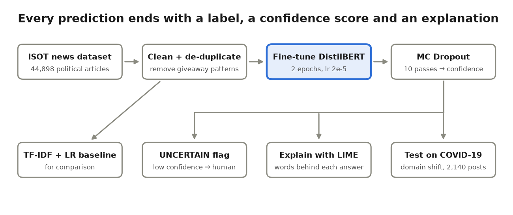

# Explainable Fake News Detection with DistilBERT and Uncertainty

[](https://colab.research.google.com/github/SI2456/Explainable-Fake-News-Detection/blob/main/Fake_News_Detection_XAI_Uncertainty.ipynb)

A fake news classifier built on fine-tuned **DistilBERT** that does more than say FAKE or REAL:

- **It says when it is unsure.** Monte Carlo Dropout gives a confidence score, and low-confidence articles are labelled `UNCERTAIN` for a human to check.
- **It explains its answer.** LIME shows which words pushed each prediction.
- **It is tested honestly.** It is trained on political news and tested on COVID-19 health posts it has never seen.

> Machine Learning subject project, B.Tech Information Technology, BVM Engineering College (GTU).



## Why the data needs cleaning

The popular Kaggle *Fake and Real News* dataset contains patterns that reveal the **source** of each article, not whether it is true:

| Pattern in the text | % of REAL | % of FAKE |
|---|---|---|
| `(Reuters)` dateline | 99.2 | 0.0 |
| "Featured image" / "image via" credit | 0.0 | 35.4 |
| "Getty Images" | 0.0 | 16.8 |
| Web link | 0.2 | 23.7 |
| Twitter @handle | 1.3 | 26.1 |
| Curly apostrophe `’` | 47.4 | 0.0 |

A model could score about 99% just by spotting these. The notebook removes them all (every row drops to 0% after cleaning) and removes duplicate articles: 44,898 → 38,244 articles.

## What's inside

| Step | Method |
|---|---|
| Baseline | TF-IDF (1–2 word phrases) + Logistic Regression |
| Model | `distilbert-base-uncased`, fine-tuned for 2 epochs, lr 2e-5, first 256 tokens |
| Uncertainty | Monte Carlo Dropout (10 passes); the least confident 5% are flagged `UNCERTAIN` |
| Metrics | Accuracy, Precision, Recall, F1, ROC-AUC, Expected Calibration Error (ECE) |
| Confidence check | Accuracy of confident vs uncertain predictions, reliability diagram, error-detection AUROC |
| Explainability | LIME word importance |
| Domain shift | Train on ISOT political news (2016–17), test on COVID-19 posts (2020) |

## Datasets

| Dataset | Use | Size |
|---|---|---|
| [Fake and Real News Dataset (ISOT)](https://www.kaggle.com/datasets/clmentbisaillon/fake-and-real-news-dataset) | train / validation / test | 44,898 articles |
| [COVID-19 Fake News Dataset (Constraint@AAAI 2021)](https://github.com/parthpatwa/covid19-fake-news-detection) | cross-domain test | 2,140 posts |

The notebook downloads both automatically. For a quick run it uses 10,000 training articles; set `train_size=None` in the settings cell to use all of them.

## How to run

**On your PC** (needs an NVIDIA GPU; about 15–20 minutes on an RTX 3050):

```bash
py -3.12 -m venv .venv
.venv\Scripts\activate
pip install torch --index-url https://download.pytorch.org/whl/cu126
pip install -r requirements.txt
jupyter notebook Fake_News_Detection_XAI_Uncertainty.ipynb
```

Then choose **Run → Run All Cells**. If you see "CUDA out of memory", set `batch_size = 8` in the settings cell.

**On Google Colab:** click the badge above, choose `Runtime → Change runtime type → T4 GPU`, then `Runtime → Run all`.

All tables and figures are saved in `results/`.

## Results

> Fill this in from `results/metrics.csv` and `results/uncertainty.csv` after running the notebook.

| Model | ISOT Acc | ISOT F1 | ISOT ECE | COVID-19 Acc | COVID-19 F1 |
|---|---|---|---|---|---|
| TF-IDF + LR | | | | | |
| DistilBERT | | | | | |
| DistilBERT + MC Dropout | | | | | |

| UNCERTAIN flag | ISOT test | COVID-19 |
|---|---|---|
| % flagged | | |
| Accuracy on confident predictions | | |
| Accuracy on UNCERTAIN predictions | | |
| % of mistakes flagged | | |

## Try it on your own text

After the notebook has run:

```python
check_news("BREAKING: Doctors are FURIOUS after this one weird trick cures diabetes overnight!")
# Verdict    : FAKE / REAL / UNCERTAIN (send to a human fact-checker)
# P(fake)    : ...  (± ... across 10 MC Dropout passes)
# Confidence : ...
# Key words  : ...
```

## Project structure

```
├── Fake_News_Detection_XAI_Uncertainty.ipynb   # the whole project, runs top to bottom
├── requirements.txt
├── docs/pipeline.png
└── results/                                    # created by the notebook
    ├── metrics.csv, uncertainty.csv, domain_shift.csv, giveaways_before_after.csv
    └── figures/                                # confusion matrices, reliability diagrams, LIME, domain shift
```

## Limitations

- Every REAL article comes from Reuters, so the model partly learns news-agency *style*, even after cleaning.
- The model judges how text is written. It does not check facts.
- Only the first 256 tokens of each article are used.
- MC Dropout can still be over-confident on very different data.

## References

1. Sanh et al. (2019). [DistilBERT, a distilled version of BERT](https://arxiv.org/abs/1910.01108)
2. Gal & Ghahramani (2016). [Dropout as a Bayesian Approximation](https://arxiv.org/abs/1506.02142)
3. Ribeiro et al. (2016). ["Why Should I Trust You?": Explaining the Predictions of Any Classifier](https://arxiv.org/abs/1602.04938)
4. Guo et al. (2017). [On Calibration of Modern Neural Networks](https://arxiv.org/abs/1706.04599)
5. Patwa et al. (2021). [Fighting an Infodemic: COVID-19 Fake News Dataset](https://arxiv.org/abs/2011.03327)
6. Ahmed, Traore & Saad (2017). Detection of Online Fake News Using N-Gram Analysis and Machine Learning Techniques. ISDDC 2017.

## Author

**Siddhraj Rajput**, B.Tech IT, BVM Engineering College · [GitHub](https://github.com/SI2456) · [Portfolio](https://si2456.github.io/myrasume)
